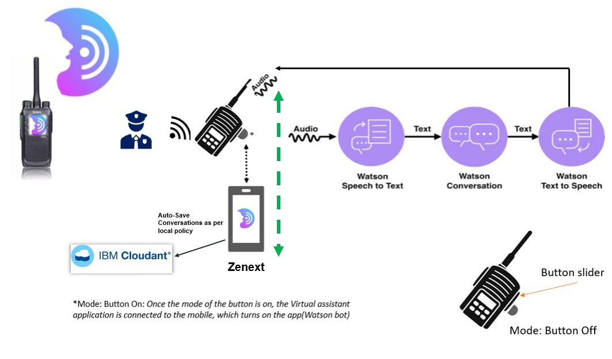
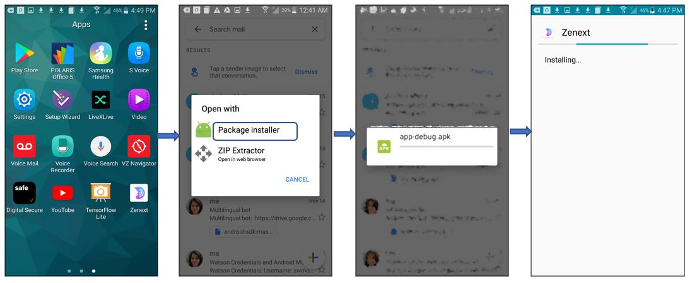
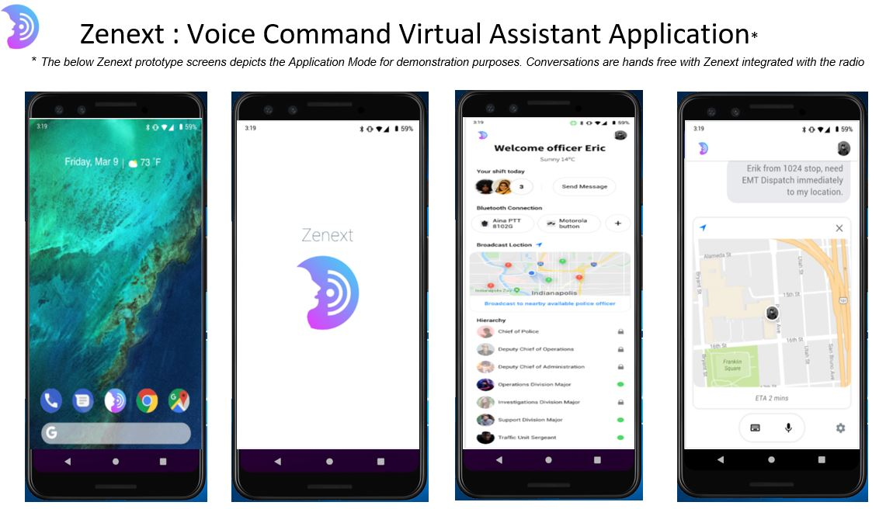

# Zenext
Final Submission
# Zenext : Voice Command Virtual Assistant for First Responders and Law Enforcement officers powered by IBM Watson and developed in Android Studio.

Zenext Virtual Assistant enabled application supports law enforcement and incident command.
The application provides both manual and voice prompt with wake word trigger, hierarchical contact list and group management, basic text and email communication and is envisioned to exchange location information and relay dynamic changes in location through voice control.
After extensive SME User Research(spanning from Indiana Police Department(PD), Chicago PD, Ohio PD, CMU PD and New York PD and User Acceptance Testing, Zenext is CJIS and HIPAA Compliant, built on the IBM Watson Cloud.
Zenext is an Android Application, and works in conjunction with Google Assistant, built on the IBM Watson Cloud, and is envisioned to harnesses the powerful database structure and IoT platform of Watson Cloud.

## Instructions on running Zenext in Emulator
1. Software requirements are Android Studio and IBM Watson cloud account.  
2. Clone the github repo: https://github.com/swarnamouli/chatbot-watson-android/ and save it to your local machine.
3. An IBM Watson API has been used to integrate Android Studio with IBM Watson Cloud. 
4. Change the API Key and URL for the Watson services as per your own credentials in the chatbot-watson-android/app/scr/main/res/values/config.xml
5. Save all changes and run the application
6. For Android emulator, go to Tools/AVD Manager and choose the specific emulator of choice
7. Happy running Zenext in Emulator!!

## Instructions on running Zenext in Android Phone
1. An Android Phone with latest version installed.
2. Download the app-debug.apk: https://github.com/swarnamouli/Zenext/blob/master/app-debug.apk file in the Android mobile.
3. Follow these steps for downloading the application successfully in the Android Mobile.

4. Happy Running Zenext in Android!!

